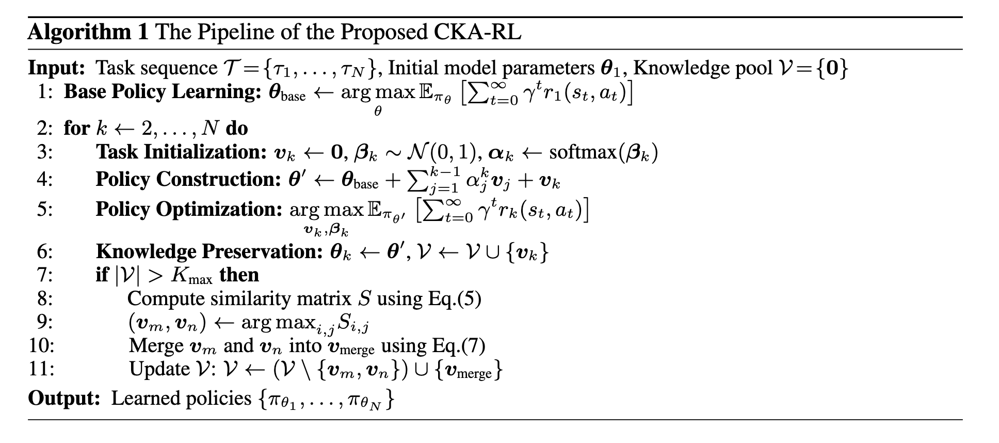
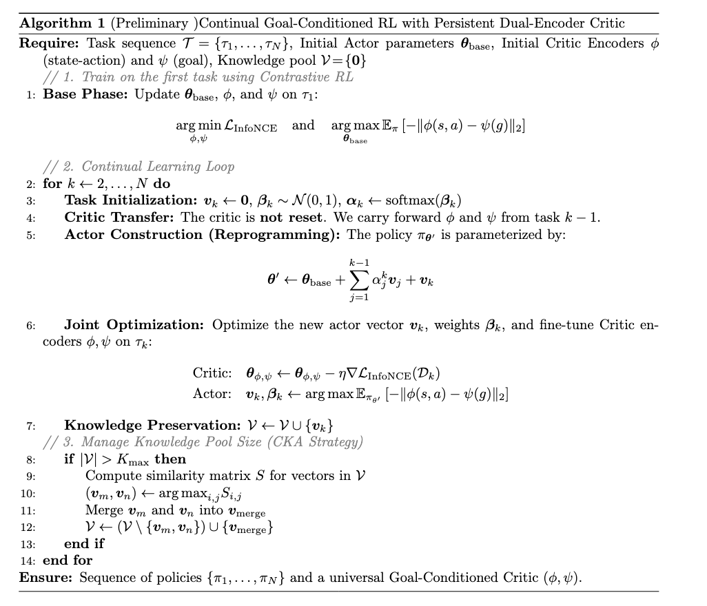
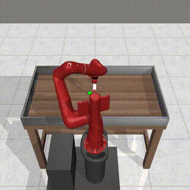
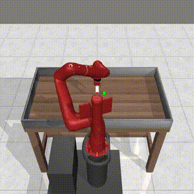

# Recap:

### Goal-Conditioned Reward

We define the reward function as the probability density of reaching a goal $g$ in the next time step: 

$$
r_g(s_t, a_t) \triangleq (1 - \gamma)p(s_{t+1} = g \mid s_t, a_t)
$$

where $\gamma$ is the discount factor.

### Discounted State Visitation Distribution

Conditioned on a policy $\pi$ and a goal $g$, the discounted state visitation distribution is defined as:

$$
p_\gamma^{\pi(\cdot|\cdot, g)}(s) \triangleq (1 - \gamma) \sum_{t=0}^{\infty} \gamma^t p_t^{\pi}(s)
$$

where $p_t^{\pi}(s)$ is the probability that policy $\pi$ visits state $s$ at step $t$.

### Goal-Conditioned Q-Function

Under this formulation, the Q-function is equivalent to the probability of visiting the goal $g$ in the future, starting from $(s,a)$:

$$
Q_g^\pi(s, a) \triangleq p_\gamma^{\pi(\cdot|\cdot, g)}(g \mid s, a)
$$

This allows us to train the critic as a classifier using contrastive learning rather than regression.

### The Objective

The general goal is to maximize the expected cumulative discounted reward over the distribution of initial states $p_0(s_0)$ and goals $p_g(g)$:

$$
\max_{\pi} \mathbb{E}_{s_0 \sim p_0, g \sim p_g, \pi} \left[ \sum_{t=0}^{\infty} \gamma^t r_g(s_t, a_t) \right]
$$

By plugging in our probabilistic definition of the reward $r_g(s_t, a_t)$, the objective becomes maximizing the total discounted probability mass of visiting the commanded goal:

$$
\max_{\pi} \mathbb{E}_{s_0 \sim p_0, g \sim p_g, \pi} \left[ \sum_{t=0}^{\infty} \gamma^t (1 - \gamma) p(s_{t+1} = g \mid s_t, a_t) \right]
$$

### InfoNCE Loss

To optimize the Q-function (critic) as a classifier, we employ the InfoNCE loss. Let the critic score be defined as the negative $L_2$ distance between the state-action embedding $\phi(s,a)$ and the goal embedding $\psi(g)$, denoted as $f(s, a, g) = -\|\phi(s, a) - \psi(g)\|_2$. Given a positive goal $g^+$ (a future state from the same trajectory) and a set of $K$ negative goals $\{g^-_j\}_{j=1}^K$ (sampled from different trajectories), the loss is:

$$
\mathcal{L}_{\text{InfoNCE}} = \mathbb{E}_{\mathcal{D}} \left[ -\log \frac{\exp(f(s, a, g^+))}{\exp(f(s, a, g^+)) + \sum_{j=1}^{K} \exp(f(s, a, g^{-_j}))} \right]
$$

---


### Observation Recap:

- Based on the definition $r_g(s_t, a_t) = (1-\gamma)p(s_{t+1}=g|s_t, a_t)$, the reward signal for 99% of the trajectory is effectively **zero**.
- We can rewrite the objective (ignoring the scaling constant $1-\gamma$ for clarity, as it doesn't change the maximization) as:

$$
\max_\pi \mathbb{E}_{\tau \sim \pi, g \sim p_g} \left[ \sum_{t=0}^{\infty} \gamma^t \cdot \mathbf{1}(s_{t+1} = g) \right]
$$

1.  **The Trajectory:** the agent generates a path: $s_0, s_1, s_2, \dots, s_{100}$.
2.  **The Sparse Signal:**
    *   At $t=0$, is $s_1$ the goal? No. $\to \mathbf{1}(\dots) = 0$.
    *   At $t=1$, is $s_2$ the goal? No. $\to \mathbf{1}(\dots) = 0$.
    *   ...
    *   At $t=k$, is $s_{k+1}$ the goal? **YES.** $\to \mathbf{1}(\dots) = 1$.
3.  **The Sum:** The summation collapses to:

$$ 0 + 0 + \dots + (\gamma^k \cdot 1) + (\gamma^{k+1} \cdot 1) + \dots $$

​    Assuming that once the agent reaches the goal, it stays there.
This effectively means the objective is to **minimize $k$** (the time it takes to reach the goal).
Since $\gamma < 1$ (e.g., 0.99), the faster you reach the goal (smaller $k$), the larger the term $\gamma^k$ becomes.

*   If you reach the goal in 5 steps: Total Value $\approx 0.99^5 \approx 0.95$.
*   If you reach the goal in 100 steps: Total Value $\approx 0.99^{100} \approx 0.36$.
*   If you never reach the goal: Total Value = $0$.

So, maximizing this sparse expectation is mathematically equivalent to **"Reaching the goal as fast as possible."**

---

### Recap 2 Training Loop of GCRL

**Phase 0: Initialization**

*   Initialize Actor network $\pi$ and Critic network $f$.
*   Initialize an empty Replay Buffer $\mathcal{D}$.
*   **Warmup:** Run the agent with random actions for 10,000 steps to get some initial data into $\mathcal{D}$.

**--- START OF LOOP (Repeat for Millions of Steps) ---**

**Phase A: Exploration (The "Online" Part)**

1.  **Reset:** The environment places the agent at a starting state $s_0$.
2.  **Sample Goal ($g_{cmd}$):** The agent needs an intention. It samples a goal $g_{cmd}$ (see Section 2 below for where this comes from).
3.  **Rollout:**
    For $t = 0$ to $T$ (e.g., 1000 steps):
    *   Observe current state $s_t$.
    *   **Select Action:** The Actor predicts an action based on the state AND the intention: $a_t = \pi(s_t, g_{cmd}) + \text{noise}$ (to explore).
    *   **Execute:** Send $a_t$ to the simulator. Get next state $s_{t+1}$.
    *   **Store:** Save the tuple $(s_t, a_t, s_{t+1}, g_{cmd})$ into the Replay Buffer.
    *   *(Note: We ignore any reward returned by the environment).*

**Phase B: Training (The Self-Supervised Part)**
*We perform $K$ gradient updates for every step taken in the environment.*

1.  **Sample Batch:** Grab $B$ random transitions $(s_i, a_i, s_{i+1}, \dots)$ from the Replay Buffer.
2.  **Hindsight Relabeling (The Magic Trick):**
    *   We ignore the original $g_{cmd}$ that the agent *wanted* to reach.
    *   We look into the future of the trajectory to see where the agent *actually* ended up. Let's call this future state $s_{future}$.
    *   We extract the goal components: $g_{achieved} = f(s_{future})$.
    *   **We pretend** this was the goal all along. The new tuple for the Critic is $(s_i, a_i, g_{achieved})$.
3.  **Critic Update (Contrastive):**
    *   **Anchor:** $(s_i, a_i)$.
    *   **Positive:** $g_{achieved}$ (The future we actually saw).
    *   **Negatives:** Sample random goals from *other* indices in the batch (or random states).
    *   Compute Loss: Minimize distance to Positive, maximize distance to Negatives (InfoNCE).
    *   Update Critic weights.
4.  **Actor Update:**
    *   Sample a fresh batch of $(s_i, a_i, g_{cmd})$.
    *   Ask Critic: "How close is this action to the goal?" $\rightarrow$ Score $= -\|\phi(s_j, a_{pred}) - \psi(g_{cmd})\|$.
    *   Update Actor weights to **Maximize** this score.

**--- END OF LOOP ---**

---

### Recap 3 CKA-RL



---

### Recap 4 Our algorithm Loop



---

### Recap 4 Problem Definition of CRL

We assume a sequence of tasks. Each task $k$ is a Markov Decision Process (MDP):
$$
M^{(k)} = \langle \mathcal{S}^{(k)}, \mathcal{A}^{(k)}, p^{(k)}, r^{(k)}, \gamma^{(k)} \rangle
$$

- **Goal:** The agent must learn an optimal policy $\pi^{(k)}$ for the current task $M^{(k)}$.

*   **Constraint 1 (Plasticity):** It must learn $M^{(k)}$ efficiently, ideally reusing knowledge from previous policies $\{\pi^{(1)}, ..., \pi^{(k-1)}\}$.
*   **Constraint 2 (Stability):** It must **not forget** how to solve $M^{(1)}$ through $M^{(k-1)}$ (avoiding Catastrophic Forgetting).

---


### Metaworld (Manipulation tasks):

### 

1. Metaworld environment  [official documentation](https://metaworld.farama.org/).

2. Metaworld's source code, see [TASK_GOAL_ANALYSIS](metaworld/TASK_GOAL_ANALYSIS.md).

3. what information is available at environment initialization, including the format and shape of observations, rewards, goals, and internal states, see [METAWORLD_ENVIRONMENT_ANALYSIS](metaworld/METAWORLD_ENVIRONMENT_ANALYSIS.md).

4. To do GCRL/contrastive RL, we need an environment wrapper that redefine reset(), and step().

---

### Environment (use hammer v2 as an example))

- **Class**: `HammerV2GoalObservable`

- **Module**: `metaworld.envs.mujoco.env_dict`

- **Inheritance Chain**: 

  ```
  HammerV2GoalObservable → SawyerHammerEnvV2 → SawyerXYZEnv → 
  SawyerMocapBase → MujocoEnv → BaseMujocoEnv → Env → Generic → EzPickle → object
  ```

- **API Compatibility**: Gymnasium-compatible (not created via `gym.make()`, but implements Gymnasium interface)

- **`max_path_length`**: 500 (maximum episode length)

Observation Space

- **Type**: `gymnasium.spaces.Box` **Shape**: `(39,)` 
- **Bounds**: Low: varies (e.g., `[-0.525, 0.348, -0.0525, -1., -inf, ...]`); High: varies (e.g., `[0.525, 1.025, 0.7, 1., inf, ...]`)

According to MetaWorld documentation, the standardized structure is:

```
observation = [
    0:2    End-effector XYZ position (3 dims)
    3      Gripper open/close scalar (1 dim)
    4:6    Object 1 XYZ position (3 dims)
    7:10   Object 1 quaternion orientation (4 dims)
    11:13  Object 2 XYZ position (3 dims, if present; else zero)
    14:17  Object 2 quaternion orientation (4 dims)
    ...    Additional state variables (velocities, previous observations, etc.)
    36:38  Goal position XYZ (3 dims) - target position for the manipulated object
]
```

For example, Task 3 (PushBackV2GoalObservable):

- **Object's current position**: Indices **4, 5, 6** (Object 1 XYZ)
- **Object's target position**: Indices **36, 37, 38** (Goal XYZ)
- Success is determined by checking if the distance between `obs[4:7]` and `obs[36:39]` is within `TARGET_RADIUS` (0.05)

### Return Values 

`reset()` **Returns**: `(observation, info)`

`step(action)` **Returns**: `(observation, reward, terminated, truncated, info)`

- **`info`**:  `dict`
  - Keys: `['success', 'near_object', 'grasp_success', 'grasp_reward', 'in_place_reward', 'obj_to_target', 'unscaled_reward']`
  - Content:
    - `success`: `float` (0.0 or 1.0) - Task completion indicator
    - `near_object`: `float` - Distance/proximity metric
    - `grasp_success`: `bool` - Whether object was grasped
    - `grasp_reward`: `float` - Reward component for grasping
    - `in_place_reward`: `float` - Reward component for placement proximity
    - `obj_to_target`: `int` - Object-to-target distance metric
    - `unscaled_reward`: `float` - Raw reward before scaling

Notes: For GCRL in general, it is important for us to know the return values and format of reset() and the step(action) function, as we need to write an env wrapper based on this, so that we can turn them into a dic, which has desired_goal $g_{cmd}$, HER_goal (which is a subset of the state).

---

### Goal Position References by Task

| Task | Environment       | Goal Refers To             | Success Condition          |
| ---- | ----------------- | -------------------------- | -------------------------- |
| 0    | HammerV2          | **Nail position**          | Nail within 0.05 of goal   |
| 1    | PushWallV2        | **Object position**        | Object within 0.05 of goal |
| 2    | FaucetCloseV2     | **Faucet handle position** | Handle within 0.05 of goal |
| 3    | PushBackV2        | **Object position**        | Object within 0.05 of goal |
| 4    | StickPullV2       | **Object position**        | Object within 0.05 of goal |
| 5    | HandlePressSideV2 | **Handle position**        | Handle within 0.02 of goal |
| 6    | PushV2            | **Object position**        | Object within 0.05 of goal |
| 7    | ShelfPlaceV2      | **Object position**        | Object within 0.05 of goal |
| 8    | WindowCloseV2     | **Window position**        | Window within 0.05 of goal |
| 9    | PegUnplugSideV2   | **Peg position**           | Peg within 0.05 of goal    |

1. **Most tasks (7/10)**: Goal refers to **object position** - the main manipulable object must be moved to the goal location
2. **Some tasks (2/10)**: Goal refers to **handle/mechanism position** - a handle or mechanism must be moved to the goal location
3. **One task (1/10)**: Goal refers to **nail position** - a nail must be driven to the goal location
4. **Success criteria**:
   - All tasks use `TARGET_RADIUS` (0.05) except HandlePressSideV2 (0.02)
   - Success is determined by `info['success']` being 1.0
   - `obj_to_target` metric indicates distance to goal (lower is better)
   - Most tasks require grasping (`grasp_success`), but some don't (push tasks)

#### Notes

1. **Goal extraction**: The goal coordinates are always in the last 3 dimensions of the observation (`observation[-3:]`), but the **target object varies by task**.
2. **Success determination**: Success is not just about reaching the goal position; it also requires:
   - Proper grasping (for tasks that require it)
   - Correct manipulation (e.g., hammering, pressing, closing)
   - Object being within the target radius
3. **Task-specific interpretation**: The same goal coordinate format is used across all tasks, but the **semantic meaning** (which object/entity) varies. You must know the task type to correctly interpret the goal.

---

### Done

1. a preliminary environment wrapper to redefine the reward, customize reset behavior, and the step(), explicitly define desired_goal and critic_goal.
2. Contrastive reinforcement learning in pytorch.
   - the critic encoders and the **environment wrapper** work correctly with the existing cka-rl codebase for continual learning, including baseline methods such as cka-rl, packnet, and self-component.
   - A shared actor backbone for the baseline methods, **ProgNet, MaskNet, CReLUs, CbpNet**.
   - Residual blocks (4 layers, skip-connections, swish activation)
   - Actor and critic training both use HER-relabeled goals (from c ritic_goal), while rollout/eval use [env_goal, 0].
3. The critic is not reinitialized when a new task arrives, and that learned information is preserved across tasks (reason: [Disentangling transfer in continual reinforcement learning](http://arxiv.org/abs/2209.13900) ).
   - Transferring the **Critic** provides the biggest boost to learning speed (Forward Transfer).
   - **Why?** A pre-trained critic already understands the physics of the world and "how to earn reward" generally, providing better gradients to the actor immediately. Transferring the Actor helps, but less so than the Critic.
4. instead of using the stable-baselines replay buffer, we need to a new buffer.py from scratch to support goal sampling from future states of a given state–action pair, while also recording trajectory IDs and related metadata.
5. debugged the full pipeline of CRL. The pipeline is working.
6. tested it on a single task, specifically task 3 in metaworld (A lot of issues now).
7. collected preliminary observations from these experiments.
8. Goal engineering for the metaworld task 3 (add another goal about [armposition - block]) so that HER relabeling can be changed. Not sure whether this step is necessarily, as in the paper Single goal is all you need, they only used one goal from the beginning to the end, and there was no goal engieering as well. 
9. Scale up the actor and critic from 4 -> 16 layers (marginal performance increases), change the UTD ratio (marginal performance increase).


---

### Jan 20 Results

- Before any goal engineering, using UTD = 1.

- Critic seems to collapse.

- Robotic arms never touch the cube (No use of HER).

  | Episode 0                                                    | Episode 900                                                  | Episode 1600                                                 |
  | ------------------------------------------------------------ | ------------------------------------------------------------ | ------------------------------------------------------------ |
  |  |  |  |


---


### Jan 22 Results

- Goal Engineered ([object_pos, ee_pos - object_pos]; when training these was extracted from the ground-truth future states; during rollouts it was set to be [object_pos, (0,0,0)];)

  | Episode 0                                                    | Episode 900                                                  | Episode 1600                                                 |
  | ------------------------------------------------------------ | ------------------------------------------------------------ | ------------------------------------------------------------ |
  |  |  |  |

  - Early exploration is too weak → object never moves → HER targets constant.
  - Data diversity is tiny (single env, step‑by‑step) → critic logits collapse.
  - UTD is too high on low‑diversity data → model quickly collapses.

---


### Jan 24

- Scale up actor and critic net from 4 layers -> 16 layers; episode return change from 0 to 14.
- change nce_update_frequency to 40 to match the paper's UTD.
- current training takes too long.
- Possible solution:
  - run 512 envs in parallel (but that perhaps would need jax implementation?).
  - Need pro-longed exploration phase/behavior policy should be more explorative.

| Episode 0                                                    | Episode 900                                                  | Episode 1600                                                 |
| ------------------------------------------------------------ | ------------------------------------------------------------ | ------------------------------------------------------------ |
|  |  |  |

---

### Jan 26

- they are collecting transitions from 512 envs in total, and result in a total steps of ~1e8, with exploration phase ~4e7.
- in SAC we usually collect transition from 1 env with total steps of 1e6, exploration phase 1e4. if we want to collect all the transitions from 1 env, then it would take   
  - 0%|          | 5443/100000000 [00:17<88:20:36, 314.41it/s]; 
  - 88hours for 1 task, not to mention there are 9 tasks awaiting us.

---

### Jan 28


- The results show that running multiple environments in parallel is very important. When using a single environment, after 3.5M steps the return is around 4–8, whereas with SAC and multiple environments, the return already reaches 23 after just 100k steps and later increases to around 4000.
- ==a plausible explanation for this is running multiple envs in parallel might lead to a different replay buffer than a single env, even with the same update ratio.==
- using cpu to run envs in parallel hits the bottlenet, we need to use gpus to do that; that means jax implementation is important, but jax seems only work with brax. Need envs' source codes.
- TODOS:
  - perhaps replicate the experiments done in [A Single Goal is All You Need](https://openreview.net/forum?id=xCkgX4Xfu0)

----


### Remarks/Takeaways/Observations:

1. off-policy Actor.

   - Rollout collection/behavior policy: goal is the environment's goal.
   - Training updates/target policy: goal uses hindsight relabeling and samples from the replay buffer.

2. Regarding the UTD ratio:

   - They do one data collection step (an “actor step”) that generates num_envs * unroll_length transitions, and then run a fixed number of SGD updates on batches from the replay buffer. That’s where the UTD comes from.
     - With the defaults:
       - num_envs=512
       - unroll_length=62
       - num_sgd_batches_per_training_step=800
       - Env steps per training step = 512*62 = 31,744.

   - Updates per training step = 800. UTD is about 800 / 31,744 which is 0.0252; <u>about 1 update per 40 environment transitions.</u>

3. The masking detail in their setup for the infoNCE loss function

   - Only ==one positive sample $(s,a,g)$.==

   - $$
     \mathcal{L}_{\text{InfoNCE}} = \mathbb{E}_{\mathcal{D}} \left[ -\log \frac{\exp(f(s, a, g^+))}{\exp(f(s, a, g^+)) + \sum_{j=1}^{K} \exp(f(s, a, g^{-_j}))} \right]
     $$

   - <u>No distinction between `(s, a, g)` from the same trajectory vs. different trajectories in the replay buffer</u>.

4. For our implementation, since we are using ==one environment==.

   - Sample transitions `(s, a, s', g')` from as many different trajectories as possible.

5. Sliced goal clarification

   - The sliced goal is the cube position, not arm position or distance.

   - If the cube never moves, the future-state goal is nearly constant across that trajectory, so HER won't provide varied goals; learning can stall unless exploration moves the cube (or other trajectories do).

6. the environment has one goal designating the object's final coordinates, let's denote it as $g_{cmd}$. 

   1. During the rollouts, actor always see observation + (g_env + some random noise); 
   2. during the training of the actor network, they sample transitions from replay buffer, they use hindsight relabeling to change the goal to make it align with the ground truth future state.

7. Any idea how to solve the collapse of the critics?

TODOS:

- perhaps replicate the experiments done in [A Single Goal is All You Need](https://openreview.net/forum?id=xCkgX4Xfu0)

---

